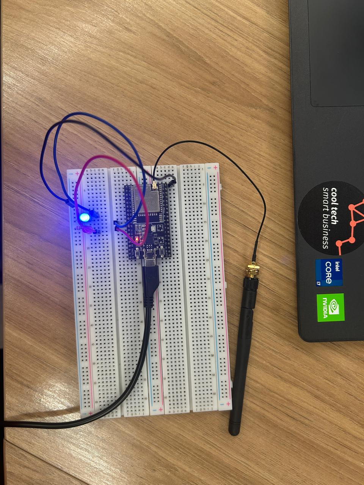
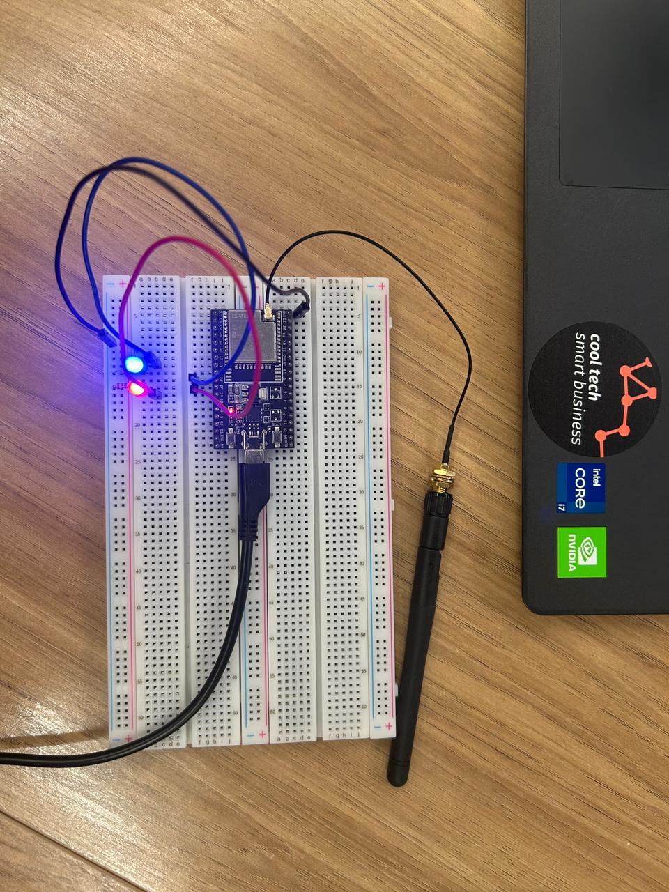
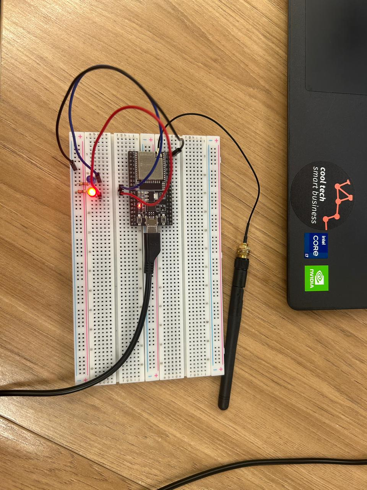
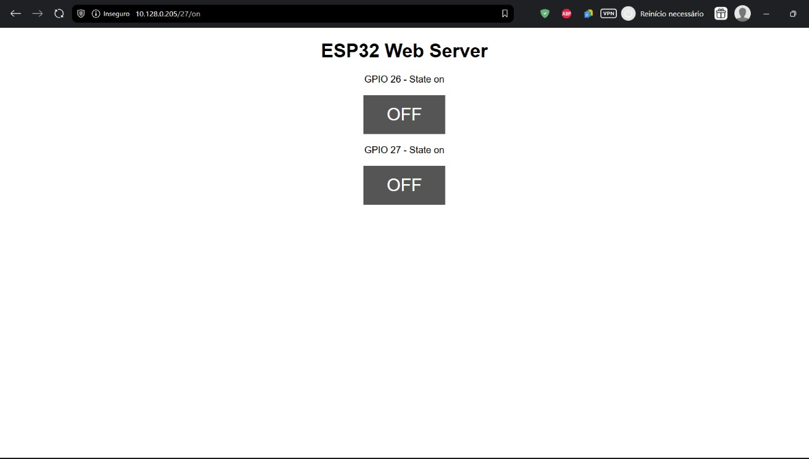
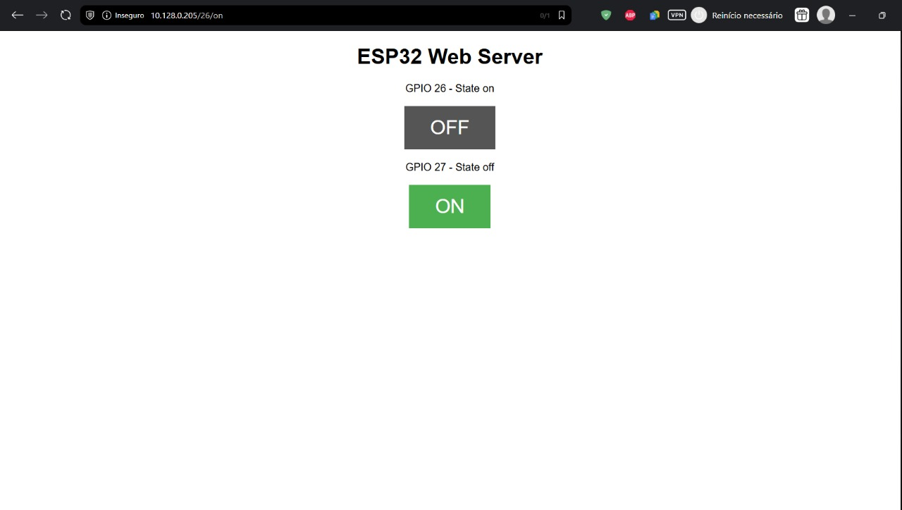
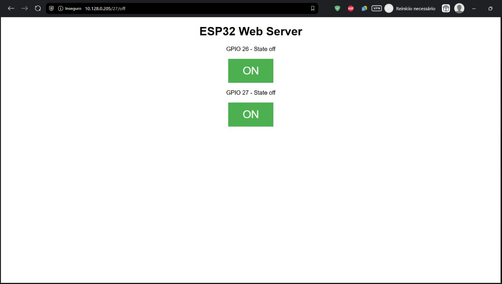

# Relatório Técnico de Análise Estática, Avaliação de Vulnerabilidades e Análise Dinâmica — Servidor Web ESP32

## Sumário

- [Introdução](#introdução)
- [Objetivo](#objetivo)
- [Metodologia](#metodologia)
- [Descrição Geral do Sistema](#descrição-geral-do-sistema)

  - [4.1 Arquitetura do Código](#41-arquitetura-do-código)
  - [4.2 Fluxo de Execução](#42-fluxo-de-execução)

- [Análise Estática do Código](#análise-estática-do-código)

  - [5.1 Pontos Fracos Estruturais](#51-pontos-fracos-estruturais)
  - [5.2 Vulnerabilidades Identificadas](#52-vulnerabilidades-identificadas)

- [Cenários de Ataque Avaliados](#cenários-de-ataque-avaliados)

  - [6.1 Ataque 1 — Controle Remoto Não Autorizado](#61-ataque-1--controle-remoto-não-autorizado)
  - [6.2 Ataque 2 — Negação de Serviço por Exaustão de Memória](#62-ataque-2--negação-de-serviço-por-exaustão-de-memória)

- [Avaliação de Probabilidade, Impacto e Risco](#avaliação-de-probabilidade-impacto-e-risco)
- [Tabela Consolidada dos Ataques (Ordenada por Risco)](#tabela-consolidada-dos-ataques-ordenada-por-risco)
- [Recomendações Técnicas de Mitigação](#recomendações-técnicas-de-mitigação)
- [Montagem Física, Teste em Protoboard e Análise Dinâmica](#montagem-física-teste-em-protoboard-e-análise-dinâmica)

  - [10.1 Montagem Física em Protoboard](#101-montagem-física-em-protoboard)
  - [10.2 Configuração do Ambiente e Upload do Código](#102-configuração-do-ambiente-e-upload-do-código)
  - [10.3 Execução do Ataque Selecionado](#103-execução-do-ataque-selecionado)
  - [10.4 Evidências](#104-evidências)

- [Conclusão](#conclusão)

---

## Introdução

Dispositivos IoT, como o ESP32, oferecem grande flexibilidade para automação residencial e industrial, mas também introduzem riscos significativos quando expostos a redes inseguras. Servidores web embarcados costumam operar sem autenticação, com validações limitadas e recursos reduzidos, ampliando a superfície de ataque.

Este relatório apresenta uma análise técnica completa de um servidor ESP32 que controla GPIOs via HTTP, descrevendo vulnerabilidades, ataques exploráveis, avaliação de risco, recomendações e um teste prático com montagem física e ataque real em ambiente controlado.

---

## Objetivo

Este documento tem como objetivos:

- Realizar análise estática do código-fonte.
- Identificar vulnerabilidades estruturais e lógicas.
- Construir e descrever cenários reais de ataque.
- Avaliar probabilidade, impacto e risco associados.
- Propor recomendações técnicas para mitigação.
- Registrar análise dinâmica com montagem física e evidências práticas.

---

## Metodologia

A análise seguiu as etapas:

1. Leitura e interpretação do código completo.
2. Identificação de padrões inseguros e vulnerabilidades.
3. Construção de ataques realistas compatíveis com o código.
4. Avaliação qualitativa de risco segundo boas práticas.
5. Montagem física em protoboard + teste manual de exploração.
6. Registro de fotos, capturas e explicações.

---

## Descrição Geral do Sistema

### 4.1 Arquitetura do Código

O código implementa:

- Servidor HTTP simples na porta 80
- Manipulação de parâmetros via rotas GET
- Controle dos GPIOs 26 e 27
- Página HTML com botões ON/OFF
- Leitura de requisições caractere a caractere

### 4.2 Fluxo de Execução

1. Inicialização do Wi-Fi e das GPIOs.
2. Aguardando cliente TCP.
3. Leitura do header HTTP em uma variável `String`.
4. Busca por substrings representando comandos.
5. Execução da ação no GPIO.
6. Retorno de página HTML ao navegador.

---

## Análise Estática do Código

### 5.1 Pontos Fracos Estruturais

- Headers não possuem limite → risco de exaustão de memória (OOM).
- Ausência total de autenticação.
- Dependência de HTTP sem criptografia.
- Uso de métodos GET para operações críticas.
- Falta de rate limiting.
- Possibilidade de DoS por conexões lentas.
- Variável global `header` cresce indefinidamente.

### 5.2 Vulnerabilidades Identificadas

- **Falta de autenticação / acesso irrestrito**
- **Execução de ações por GET (não idempotente)**
- **Exaustão de memória por header ilimitado**
- **DoS por múltiplas conexões simultâneas**
- **HTTP sem criptografia (risco de MITM)**
- **CSRF devido à ausência de proteção**
- **Falta de validação de entrada**

---

## Cenários de Ataque Avaliados

### 6.1 Ataque 1 — Controle Remoto Não Autorizado

Um atacante na mesma rede pode acionar GPIOs sem qualquer permissão.

Exemplo:

```bash
curl http://<ip>/26/on
```

- Probabilidade: **Alta**
- Impacto: **Alto**
- Risco: **Crítico**

### 6.2 Ataque 2 — Negação de Serviço por Exaustão de Memória

O header pode ser inflado indefinidamente, causando travamento ou reboot.

Exemplo:

```bash
nc <ip> 80
<enviar header gigante>
```

- Probabilidade: **Média-Alta**
- Impacto: **Médio-Alto**
- Risco: **Alto**

---

## Avaliação de Probabilidade, Impacto e Risco

Escala qualitativa utilizada:

- **Probabilidade:** Baixa → Alta
- **Impacto:** Baixo → Muito Alto
- **Risco:** combinação dos dois

---

## Tabela Consolidada dos Ataques (Ordenada por Risco)

| Ataque                           | Probabilidade | Impacto    | Risco       |
| -------------------------------- | ------------- | ---------- | ----------- |
| Controle Remoto Não Autorizado   | Alta          | Alto       | **Crítico** |
| Exaustão de Memória              | Média-Alta    | Médio-Alto | **Alto**    |
| MITM (HTTP Claro)                | Média         | Médio      | Médio       |
| CSRF                             | Média         | Médio      | Médio       |
| Conexões lentas (Slowloris-like) | Média         | Médio      | Médio       |

---

## Recomendações Técnicas de Mitigação

- Implementar autenticação (senha/token).
- Limitar tamanho do header (ex.: 1 KB).
- Substituir `String` por buffer estático.
- Usar POST com token para ações sensíveis.
- Segmentar rede IoT / usar firewall.
- Implementar watchdog, failsafe e rate limiting.
- Adotar TLS quando viável.

---

## Montagem Física, Teste em Protoboard e Análise Dinâmica

### 10.1 Montagem Física em Protoboard

Elementos utilizados:

- ESP32 fixado na protoboard
- GPIOs 26 e 27 conectados a LEDs
- Resistores de 220–330 Ω
- Alimentação via USB

**Inserir as fotos reais nesta seção.**

### 10.2 Configuração do Ambiente e Upload do Código

Passos realizados:

1. Configuração da Arduino IDE com ESP32 Board Manager.
2. Carregamento do código-fonte analisado.
3. Seleção da placa _ESP32 Dev Module_.
4. Seleção da porta correta.
5. Upload realizado com sucesso.

**Sugestão:** inserir screenshot da IDE após upload.

---

### 10.3 Execução do Ataque Selecionado

Ataque escolhido: **Controle Remoto Não Autorizado**.

Procedimento:

1. Obter IP do ESP32 pela serial.
2. No terminal, executar:

```bash
curl http://<ip>/26/on
```

3. LED no GPIO 26 acende.

Desligamento:

```bash
curl http://<ip>/26/off
```

**Resultado observado:**

- Vulnerabilidade confirmada na prática.
- Dispositivo aceitou requisições sem autenticação.

---

### 10.4 Evidências

**Vídeo do sistema em funcionamento:**
[https://drive.google.com/file/d/1MS_gGugHI9Wp1zIO5Vg0zsS3HQ7wJaay/view?usp=sharing](https://drive.google.com/file/d/1MS_gGugHI9Wp1zIO5Vg0zsS3HQ7wJaay/view?usp=sharing)

## 10.4 Evidências (Fotos, Capturas e Simulações)

### Representação do Circuito

<div align="center">
<sub>Figura 7 – Modelo do circuito utilizado na prototipação</sub>


<sup>Fonte: Material produzido pelos autores (2025)</sup>

</div>

---

<div align="center">
<sub>Figura 1 – Montagem física: LED azul ligado (GPIO ativo)</sub>



<sup>Fonte: Material produzido pelos autores (2025)</sup>

</div>

<div align="center">
<sub>Figura 2 – Montagem física: LEDs vermelho e azul ligados simultaneamente</sub>



<sup>Fonte: Material produzido pelos autores (2025)</sup>

</div>

<div align="center">
<sub>Figura 3 – Montagem física: LED vermelho ligado (GPIO acionado via ataque)</sub>



<sup>Fonte: Material produzido pelos autores (2025)</sup>

</div>

---

### Simulações dos Estados Lógicos dos GPIOs

<div align="center">
<sub>Figura 4 – Simulação: ambos os LEDs desligados</sub>



<sup>Fonte: Material produzido pelos autores (2025)</sup>

</div>

<div align="center">
<sub>Figura 5 – Simulação: um LED ligado</sub>



<sup>Fonte: Material produzido pelos autores (2025)</sup>

</div>

<div align="center">
<sub>Figura 6 – Simulação: dois LEDs ligados</sub>



<sup>Fonte: Material produzido pelos autores (2025)</sup>

</div>

---

## Conclusão

A análise estática e dinâmica demonstrou que o servidor web do ESP32 apresenta vulnerabilidades críticas, especialmente pela ausência de autenticação, uso de GET para alteração de hardware e falta de limites na leitura de headers. O ataque testado foi reproduzido com facilidade, confirmando alto risco quando o dispositivo está em uma rede sem segmentação.

A aplicação das recomendações propostas aumentaria significativamente a segurança e reduziria a superfície de ataque. A análise dinâmica reforça a importância de validar vulnerabilidades não apenas teoricamente, mas também fisicamente.
